# Анализ пиков

## Скачали данные, разархивируем и обрезаем

```bash
export x=ENCFF283ZMN; zcat $x.bed.gz | cut -f1-5 > $x.hg38.bed
```
Переменная вместо `xargs` потому что проще и быстрее для всего двух.

## Строим гистограммы с помощью скрипта с семинара


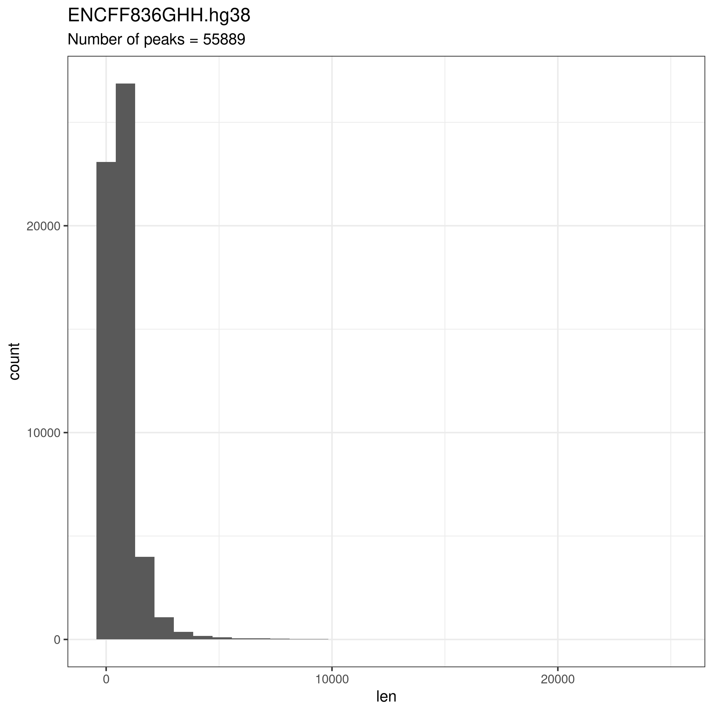

## Переводим все в hg19

```bash
wget wget https://hgdownload.cse.ucsc.edu/goldenpath/hg38/liftOver/hg38ToHg19.over.chain.gz\n
export x=ENCFF283ZMN; liftOver $x.hg38.bed hg38ToHg19.over.chain.gz $x.hg19.bed $x.unmapped.bed
```


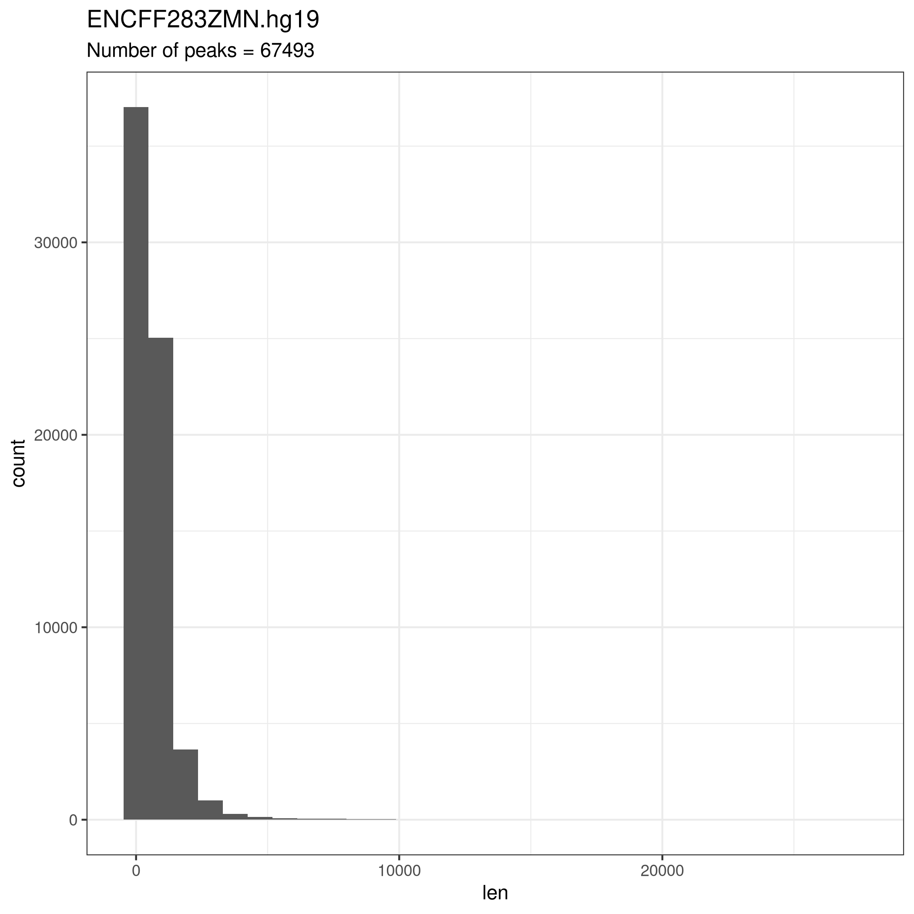
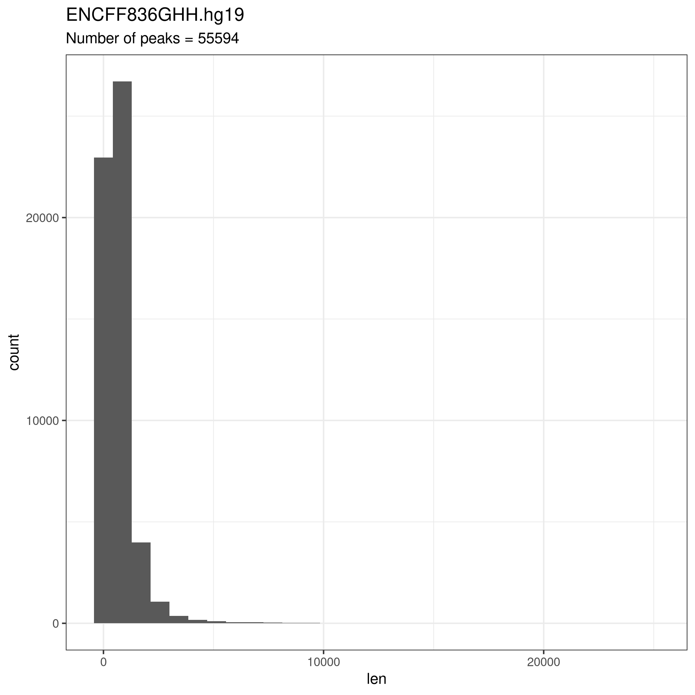


## Фильтруем слишком длинные пики
Отсекаем пики по длине 600, потому что получаются наилучшие графики.

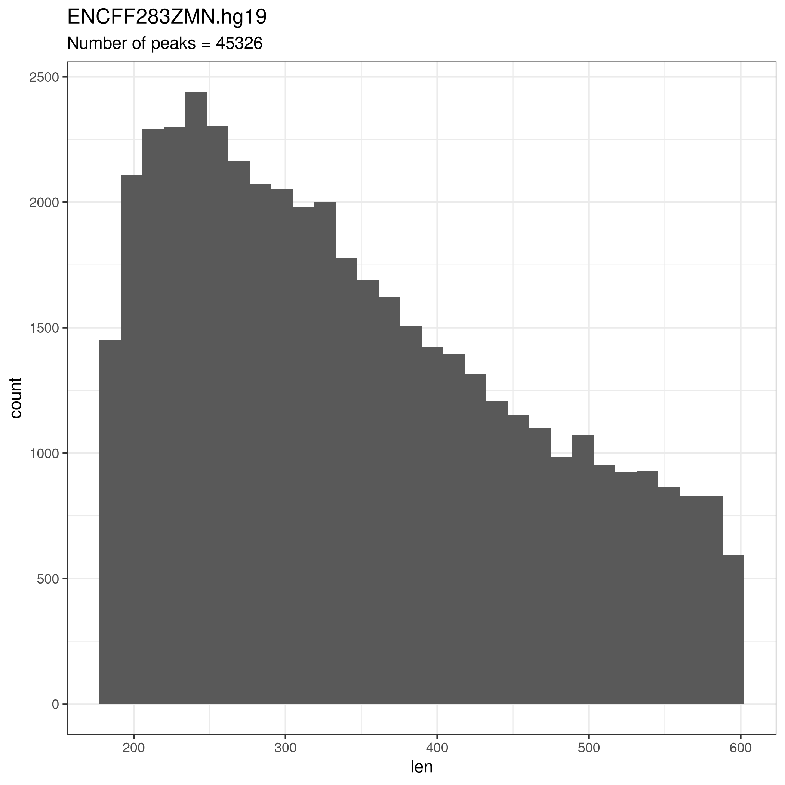
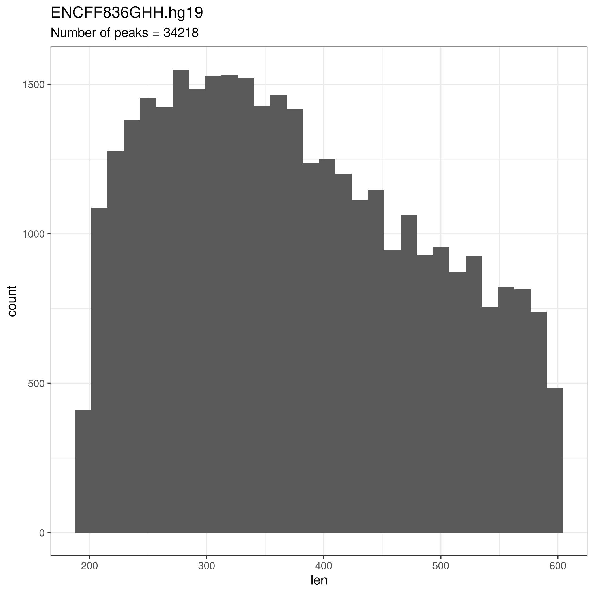

## Смотрим в genome browser
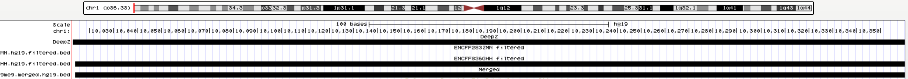

## Расположение меток

Используем `chip_seeker.R` с семинара

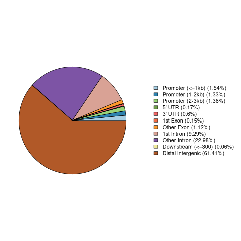


# Вторичная структура ДНК

Скачиваем `DeepZ` и смотрим
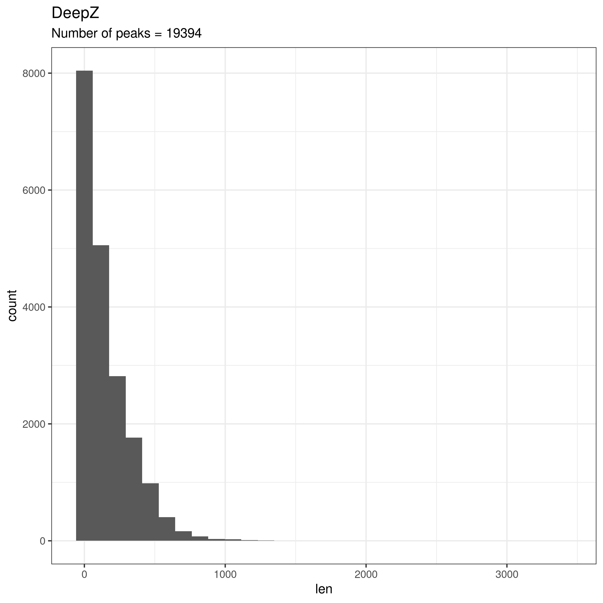
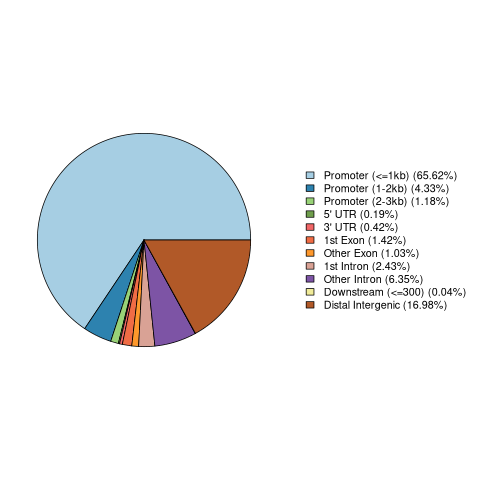


## Объединяем

```bash
% cat ENCFF283ZMN.hg19.filtered.bed ENCFF836GHH.hg19.filtered.bed | sort -k1,1 -k2,2n| bedtools merge > H3K9me9.merged.hg19.bed
% wc -l H3K9me9.merged.hg19.bed
69531 H3K9me9.merged.hg19.bed
% wc -l *filtered*
  45326 ENCFF283ZMN.hg19.filtered.bed
  34218 ENCFF836GHH.hg19.filtered.bed
  79544 total
```

Примерно 10 тысяч пересечений


## Пересекаем с DeepZ

```bash
bedtools intersect  -a DeepZ.bed   -b  H3K9me9.merged.hg19.bed  >  H3K9me9.intersect_with_DeepZ.bed
```
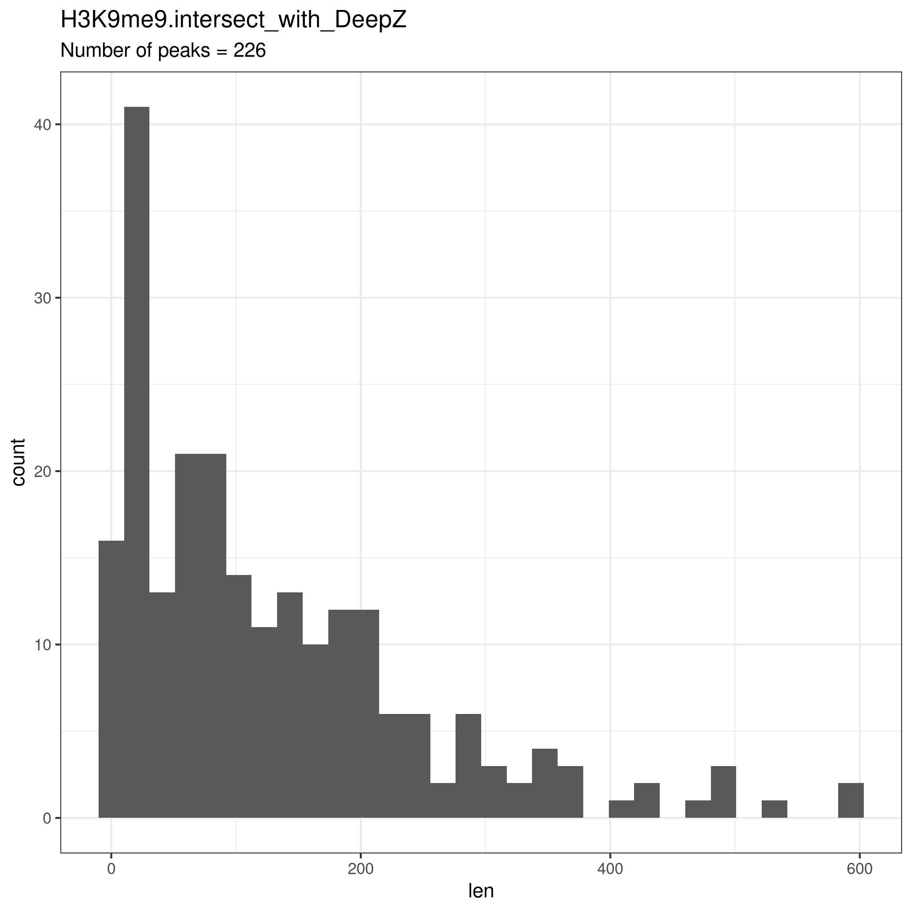
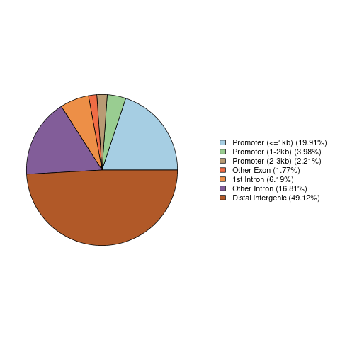

## Смотрим в Genome browser
[Сессия](http://genome.ucsc.edu/s/asokol123/minor_project)
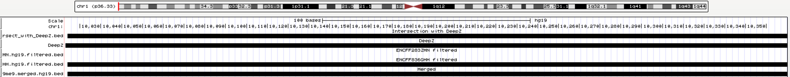

## GO-анализ
Используем `ChIPpeakAnno.R` и загружаем в pantherdb.org

Полученные уникальные гены:
```
DDX11L1
SDF4
CR2
ZNF695
ZNF717
CD47
PODXL2
HLTF
TRIM59
IFT80
EIF5A2
KDM3B
RPS14
LOC650226
MESTIT1
XKR6
TCF24
XKR9
LACTB2
ARHGAP39
ZCCHC7
ZNF883
PSMB7
C10orf88
GLS2
FGF7
TAOK2
DHX40
ZFR2
ZNF846
HPN-AS1
MACROD2
SEL1L2
NDUFA6-DT
```

`No statistically significant results`

Но как видим, результаты не статистически значимы

Полные результаты в [файле](./images/pantherdb_GO_analysys.txt)

Самые значимые (и все равно не статистически значимые) на картинке:

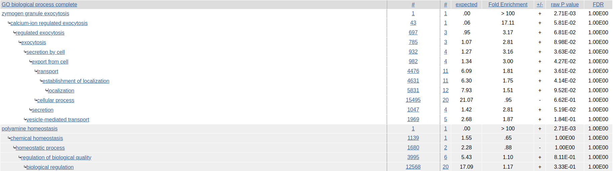